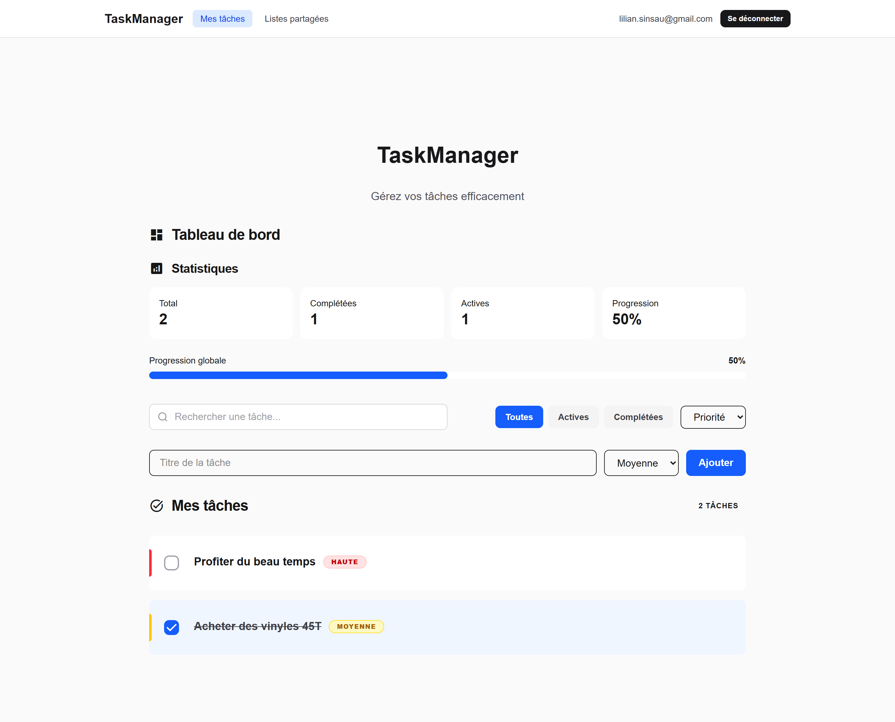

# TaskManager

Application de gestion de tâches construite avec Next.js et Firebase.

## Lien de l'application

- Production : [https://taskmanager-filrouge-a050a.web.app/](https://taskmanager-filrouge-a050a.web.app/)

## Lien du repository

- Répertoire GitHub : [https://github.com/lisinsau/taskmanager.git](https://github.com/lisinsau/taskmanager.git)

## Fonctionnalités

- Authentification utilisateur (inscription, connexion, déconnexion)
- Gestion des tâches personnelles (ajout, suppression, mise à jour, statut)
- Recherche, filtres et tri des tâches
- Tableau de bord avec statistiques et progression
- Listes partagées avec collaboration en temps réel
- Gestion des membres d'une liste partagée

## Stack technique

- Next.js (App Router)
- React
- Firebase Auth
- Firestore
- Tailwind CSS